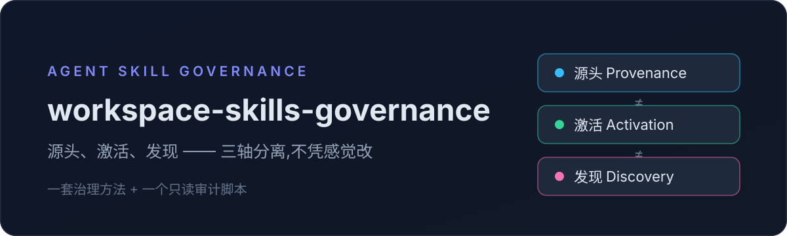
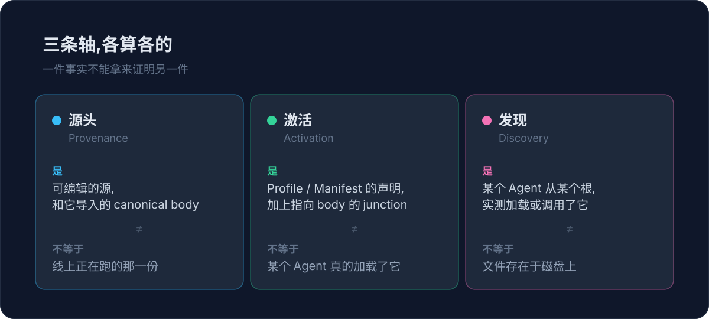

<div align="center">
  
</div>

# workspace-skills-governance

这个 Skill 把一组 Agent Skill 的源头、激活和运行时发现分成三件独立的事来治理，让人在升级、去重和迁移时不会凭感觉改坏。它是一套治理方法，外加一个只读的审计脚本。

## 价值

它帮同时维护 user、workspace、项目等多个作用域 Skill 的人，回答一句容易被糊弄过去的话：这个 Skill 现在到底激活没有、改哪一份才安全。它只提供方法和审计，不代替你工作区里的控制面脚本，也不替你写新的 Skill。

## 证据

当前版本是 1.1.0，在本地做过结构校验，并完成过一次真实升级演练：两个 Skill 经过 preview 加回滚保护完成替换。这些检查不能证明别人安装之后会得到同样的结果。没有安装量和用户数，这里就不写。

触发它可以直接说:「盘点这个 workspace 的 Skill，告诉我哪一份是 canonical。」

## 机制

Agent 在涉及 Skill 的盘点、激活、升级、去重或迁移时读取它。它先盘点 Git 根、Agent 入口、body、registry、Profile 和消费者，再把源头、激活、发现三条轴分开记录，最后只通过已发现的控制面在 preview 之后落地，并留下恢复点。这里不展开目录结构。

<div align="center">
  
</div>

## 最短上手

你可以直接对 Agent 说:「治理这个 workspace 的 Skill，先只读盘点，不要改。」

安装命令:

```bash
npx skills add Jhyphlau/workspace-skills-governance
```

## 使用边界

这个仓库不做什么、需要什么前提，以及会影响「用不用」的失败方式。

- 没有控制面时：它保持只读，只给出盘点和一份建议的契约，不替这个工作区创建治理状态。
- 需要的能力：审计脚本要 PowerShell(pwsh，或 Windows PowerShell 5.1)；升级、替换这类改动，要工作区里存在兼容的控制面脚本。
- 常见的失败方式：触发描述写得太窄时它不会自动介入；结构存在不等于运行时被发现，两者不能互相证明。

## 深入阅读

- 治理模型与边界判定，见 [references/governance-model.md](references/governance-model.md)。
- 版本替换与回滚，见 [references/version-replacement.md](references/version-replacement.md)。
- 证据分级与收口契约，见 [references/verification.md](references/verification.md)。
- 本仓库是 Jhyphlau 的作品，正文没有借鉴上游实现。
- 许可证是 MIT，见 [LICENSE](LICENSE)。
